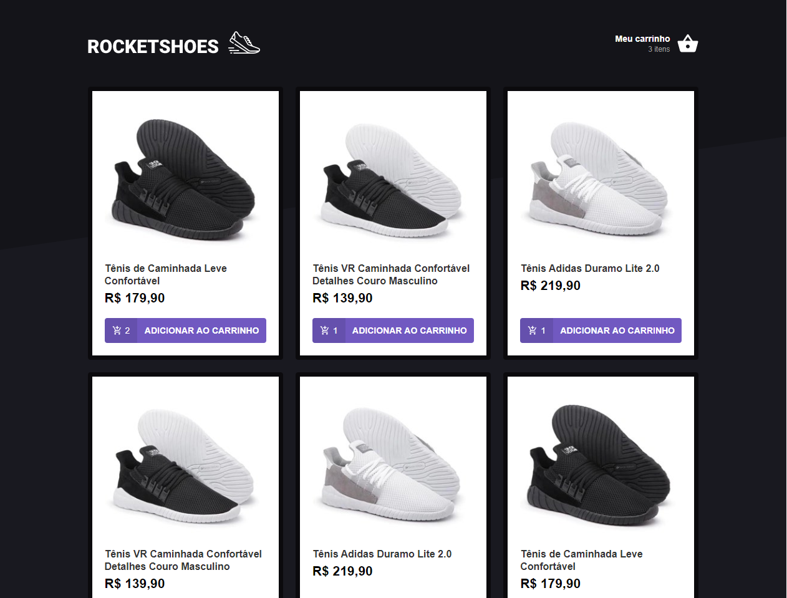
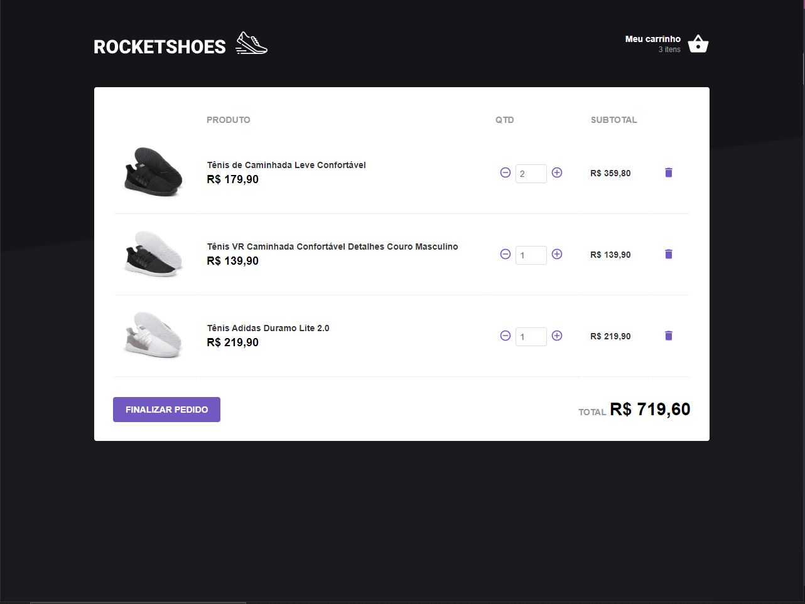
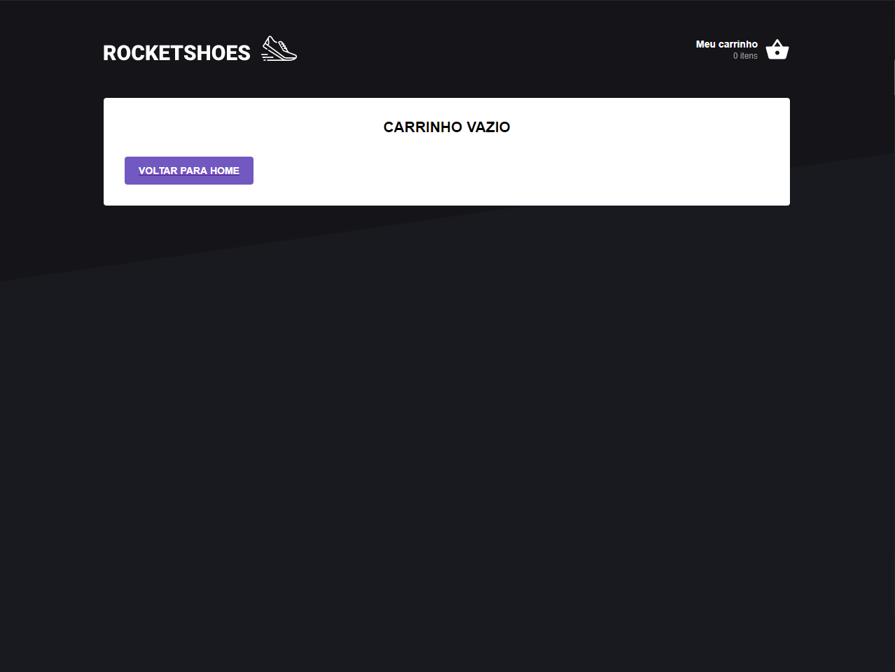

<h1 align="center">
    Rocketshoes (WEB)
</h1>

 

## :camera: Demonstração

## :rocket: Tecnologias

Esse projeto foi desenvolvido com as seguintes tecnologias:

✔️React

✔️Arquitetura Flux

✔️Redux

✔️Redux Saga

✔️Styled Components

✔️Axios

✔️Json-server

✔️Reactotron

✔️React-Toastify

## 💻 Projeto

Rocketshoes (WEB) é aplicação feita utilizando ReactJS, que implementa o fluxo de carrinho de compras de um e-commerce. Durante os estudos, tive meu primeiro contato com os conceitos de #Redux e Saga, além de conhecer novas ferramentas que auxiliam no dia a dia de um DEV. como o  #Reactotron e do JsonServer.

## ⚙ Configuração

1- Para instalar as dependências:
> yarn

2- Para iniciar a aplicação:
> yarn start

3- Instalar json-server:
> npm install -g json-server

4- Para iniciar o json-server:
> json-server server.json --port 3333

---

